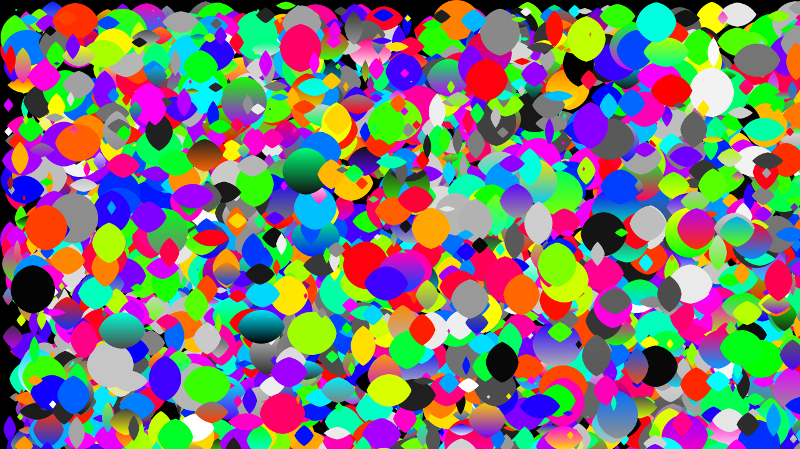
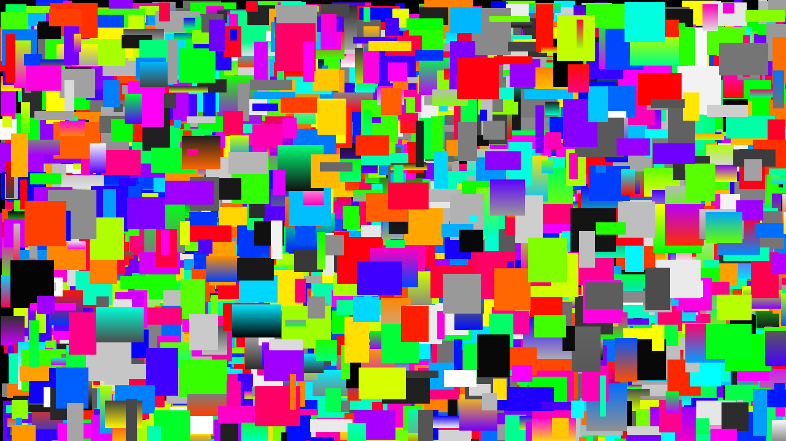

# PrimeManifest

PrimeManifest is a C++23 2D software renderer with palette-driven batching, text layout, and a focused optimization harness.

## Building

```sh
cmake -S . -B build-debug -DCMAKE_BUILD_TYPE=Debug
cmake --build build-debug
```

```sh
cmake -S . -B build-release -DCMAKE_BUILD_TYPE=Release
cmake --build build-release
```

Optional configuration:
- `-DPRIMEMANIFEST_BUILD_TESTS=ON/OFF` toggles tests.
- `-DPRIMEMANIFEST_BUILD_EXAMPLES=ON/OFF` toggles example binaries.

## Tests

```sh
ctest --output-on-failure
```

## Coverage

```sh
./scripts/compile.sh --coverage
```

Coverage reports are written to `build-debug/coverage/`.

## Examples

Text rendering demo:

```sh
./build-debug/text_render_demo
```

## Fonts

PrimeManifest ships with bundled Noto Sans fonts in `assets/fonts/` and loads them by default.
If no bundled fonts are found, the registry falls back to OS font directories.

Renderer benchmark (rects):

```sh
./build-release/renderer_bench --frames 1 --no-text --radius 0 --seed 1337 --dump renderer_bench_rects.ppm
```

Renderer benchmark (balls):

```sh
./build-release/renderer_bench --frames 1 --no-text --radius 40 --seed 1337 --dump renderer_bench_balls.ppm
```

## Results

Text rendering example:


Ball rendering benchmark:



Rect rendering benchmark:


